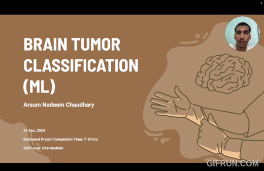

# Brain Tumor Classification Project

## Overview
This project uses deep learning techniques to classify brain tumors based on MRI images. The project also provides an interactive platfrom through Streamlit for predictions and visualization, as well as saliency maps and interpretation for model predictions. All of this is found in the notebooks folder.

The classification task involves identifying tumor types based on MRI scans, with confidence scores provided for each prediction.

## Click Below To Get Demo

[](https://www.youtube.com/watch?v=QWGz6a7xQn0)

---

## Features
- Classifies brain tumors into one of four different categories.
- Generates saliency maps to visualize how the model makes predictions.
- Provides confidence scores for each tumor type.
- Enables comparison between two pre-trained models (e.g., `CNN` and `Xception`).
- Includes interactive functionality via a Streamlit app.
- Provides explanations for prediction

---

## Dataset
- **Dataset Source**: The dataset used for this project contains brain MRI images labeled with tumor types. It can be downloaded from [Kaggle](https://www.kaggle.com/), specifically from the dataset titled "[Brain MRI Images for Brain Tumor Detection](https://www.kaggle.com/navoneel/brain-mri-images-for-brain-tumor-detection)".
- **Structure**: The dataset includes four categories and Test/Train Data:
  - Glioma Tumors
  - Meningioma Tumors
  - Pituitary Tumors
  - No tumors.
- **Data Preprocessing**: The notebook includes steps for:
  - Data augmentation (e.g., rotation, flipping, scaling).
  - Resizing images to a uniform size.
  - Splitting the dataset into training, validation, and testing sets.

---

## Models
The project implements and compares the following models:
1. **Convolutional Neural Network (CNN)**:
   - A custom-built CNN architecture with multiple convolutional and dense layers.
   - Trained on the preprocessed dataset for tumor classification.

2. **Xception Pre-trained Model**:
   - A transfer learning approach using the `Xception` architecture.
   - Fine-tuned for the brain tumor classification task.

**Performance Metrics**:
- Both models are evaluated using accuracy, precision, recall, and F1-score.
- The Streamlit app allows toggling between the two models for predictions.

---

## Folder Structure

```

Brain-Tumor-Classification/
├── app.py                   # Main application script
├── notebooks/               # Jupyter notebook that conatins everything
├── static/
│   └── saliency_maps/       # Visual outputs of model predictions
├── sample_data/             # Sample MRI images for testing
├── models/                  # Pre-trained models
├── requirements.txt         # Project dependencies
└── README.md                # Project documentation

```

Additionally you will need a GOOGLE_API_KEY and a NGROK_AUTH_KEY that can be easily generated online.
The google api key helps with generating text to explain our model decision.
The ngrok auth key helps build the streamlit pipeline and run it concurrently with colab.

---

## Results

How the UX looks like:


Finding Meningioma:


Saliency Map:


## Installation
To set up and run the project locally, follow these steps:

1. **Clone the Repository**:
   git clone https://github.com/AvidThinkerArsum/Brain-Tumor-Classification.git
   cd Brain-Tumor-Classification

2. **Install Dependencies:** 
   Ensure Python 3.7+ is installed on your machine. Then run:
   pip install -r requirements.txt

3. Download the Dataset:

Download the dataset at Kaggle from the above link.
Place the downloaded dataset into the sample_data/ folder.

4. Run the Streamlit App: Start the application by running:

streamlit run app.py

## Usage
1. Upload an MRI image using the Streamlit app.
2. Select the model (CNN or Xception) for predictions.
3. View the classification result (tumor or no tumor), confidence scores for each tumor type, saliency maps showing the regions of the image that influenced the model's prediction.

## Jupyter Notebook Details
The included notebook (data_processing_and_training.ipynb) contains:

## Dataset preprocessing steps:
1. Data augmentation techniques for increasing dataset variability.
2. Train-test split for robust evaluation.
Model training:
Implementation of a custom CNN.
Fine-tuning of the Xception pre-trained model.
3. Evaluation:
Accuracy, precision, recall, and F1-score metrics.

## Future Improvements
1. Add more advanced saliency map visualizations (e.g., Grad-CAM).
2. Experiment with other pre-trained architectures (e.g., ResNet, VGG).
3. Include additional datasets for multi-class tumor classification.

## License
This project is licensed under the MIT License.
